## Delicias del Ayer - Portal Web Interactivo

Este repositorio contiene el código fuente de la plataforma web para Delicias del Ayer, una repostería artesanal tradicional ubicada en Bucaramanga. La aplicación permite a los usuarios explorar el catálogo de productos, interactuar con un diseñador de pasteles personalizados y gestionar un carrito de compras que se conecta directamente con el canal de atención de WhatsApp para finalizar los pedidos.

---

## Prototipo y Diseño de la Interfaz

El diseño visual de los componentes, la tipografía y el esquema de colores de la plataforma fueron planificados e iterados inicialmente en Figma. Puede acceder al proyecto interactivo a través del siguiente enlace:

*   **Proyecto en Figma:** [Ver Prototipo de Delicias del Ayer](https://www.figma.com/design/FqHBA53nlPdXXzPW9k7POL/Sin-t%C3%ADtulo?node-id=0-1&p=f&t=9QSYp3ItKCLJycpk-0)

---

## Galería de la Interfaz de Usuario

### Página de Inicio

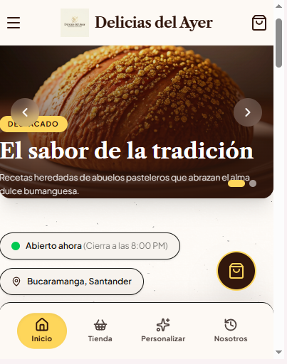

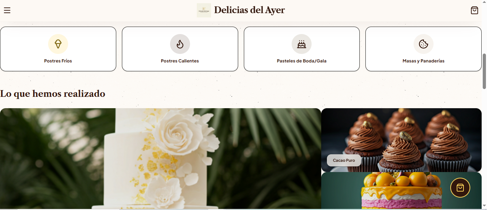

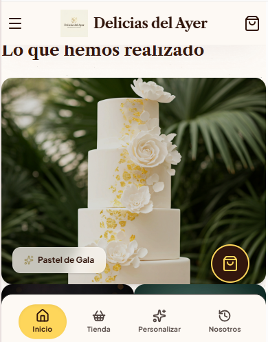

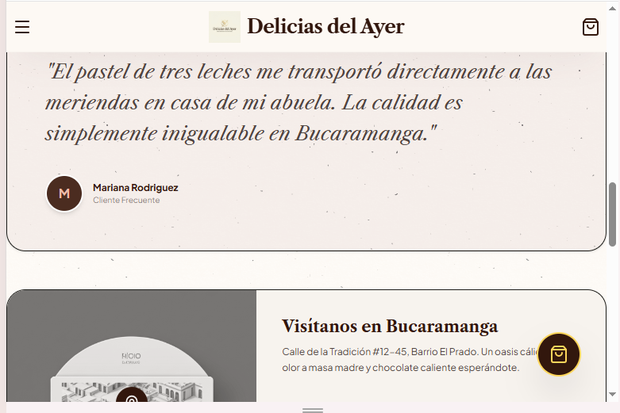

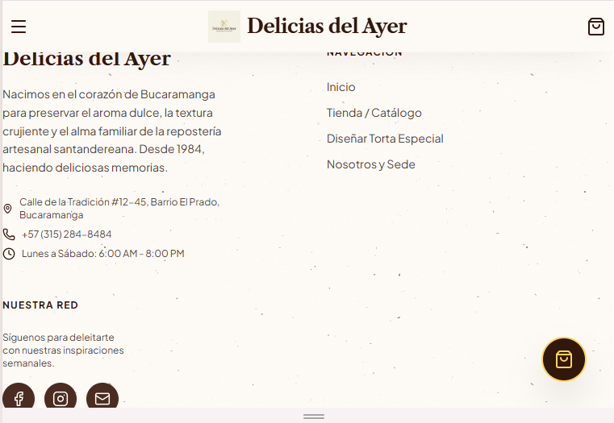

### Navegación y Opciones

### Catálogo de Productos

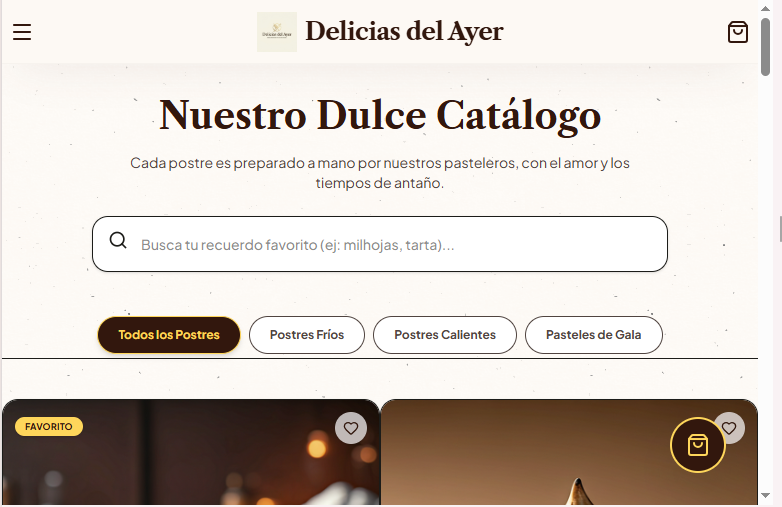

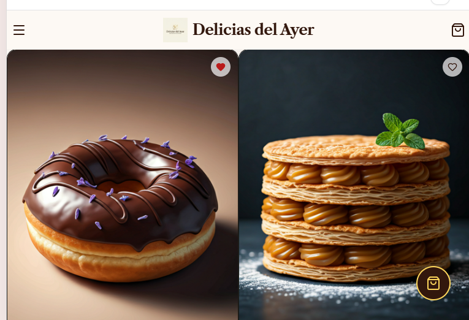

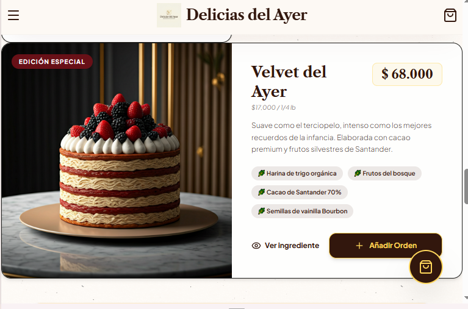

### Personalización de Pasteles

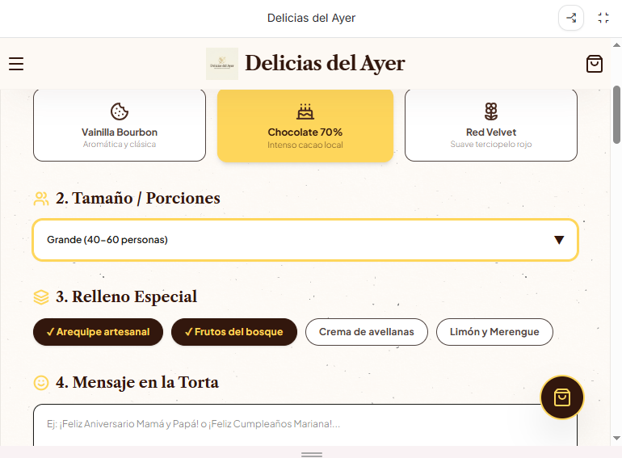

### Carrito de Compras

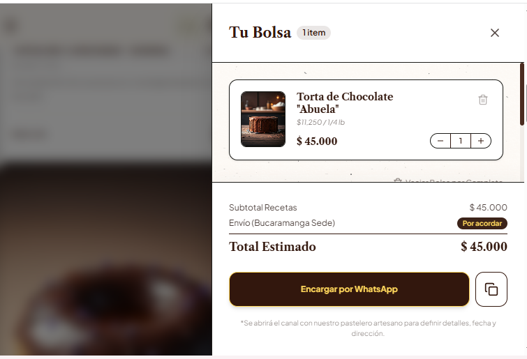

### Comentarios y Opiniones

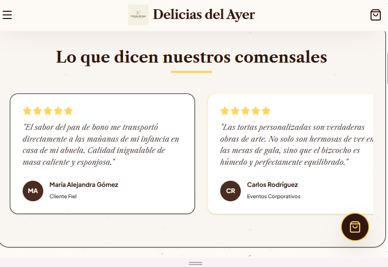

### Horario de Atención

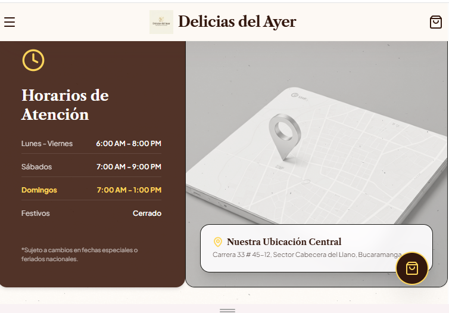

### Preguntas Frecuentes

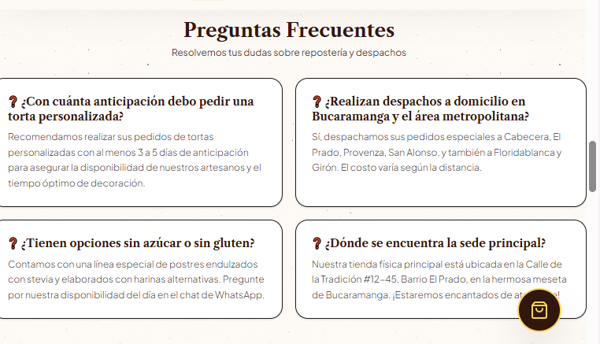

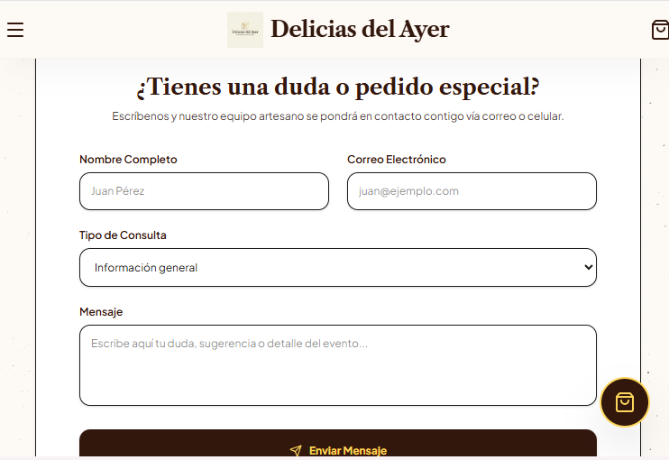

### Captura Adicional

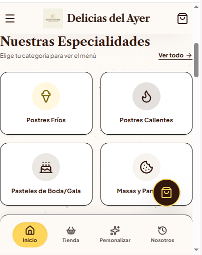

---

## Características Principales

*   **Carrusel Dinámico:** Deslizador automatizado en la pantalla de inicio para destacar promociones, productos e imágenes de la marca.
*   **Catálogo Filtrable:** Sistema de búsqueda en tiempo real por texto y filtrado estricto por las categorías configuradas en la aplicación (frio, caliente, pastel).
*   **Diseñador de Pasteles:** Formulario interactivo que permite seleccionar sabores de bizcocho, tamaños, rellenos, añadir un mensaje personalizado y cargar una imagen de referencia.
*   **Carrito de Compras:** Gestión reactiva que permite añadir productos, modificar cantidades, eliminar elementos y calcular el total en pesos colombianos (COP).
*   **Integración con WhatsApp:** Generación automática de mensajes con plantillas estructuradas que contienen el resumen del pedido o las especificaciones del pastel personalizado.
*   **Estado de Horario en Vivo:** Componente basado en la hora del sistema que indica si el establecimiento se encuentra abierto o cerrado según el horario comercial (8:00 AM a 8:00 PM).
